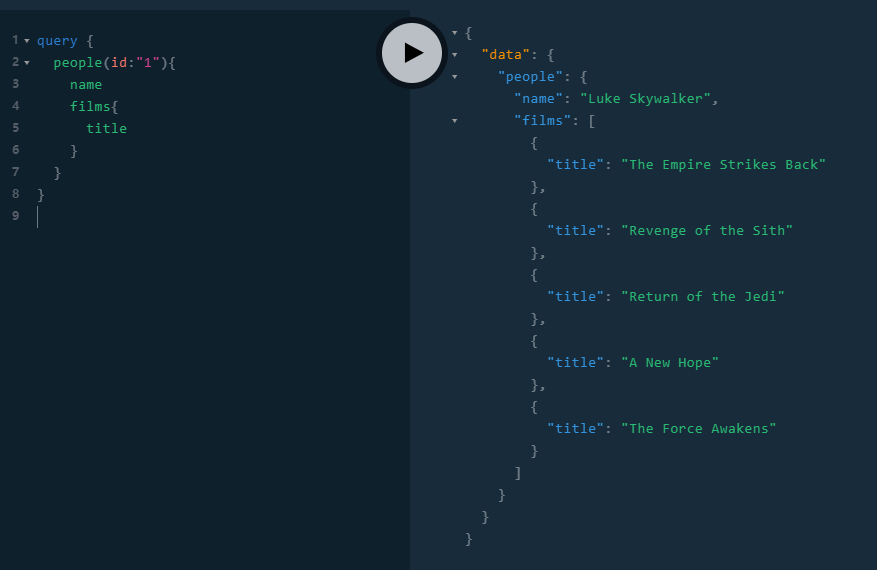

[TOC]

# 构建GraphQL服务

## gqlgen工具介绍

> [gqlgen](https://github.com/99designs/gqlgen) is a golang library for building graphql servers without any fuss. gqlgen is:
>
> - Schema first: You define your API using the graphql [Schema Definition Language](http://graphql.org/learn/schema/)
> - Type safe: You should never see `map[string]interface{}` here.
> - Codegen: Let us generate the boring bits, so you can build your app quickly.

[gqlgen](https://github.com/99designs/gqlgen)是一个开源的GraphQL API服务构建工具，关于GraphQL的介绍参加我的另一篇文章[GraphQL核心概念](https://blog.csdn.net/liuyh73/article/details/85010148)。下面进行项目的构建，以我的一次作业，使用GraphQL构建服务并复制[SWAPI](https://swapi.co/)界面（小组合作开发）为例，完整代码详见[Github](https://github.com/Go-GraphQL-Group/GraphQL-Service)。第一次使用GraphQL，项目结构还不够完善。

文章所用代码为[GraphQLdemo](https://github.com/liuyh73/GraphQLdemo)

- 下载安装gqlgen工具：

```bash
$ go get github.com/99designs/gqlgen
```

- 创建项目文件夹：

```bash
$ mkdir -p $GOPATH/src/github.com/[username]/[project-name]
# mkdir -p $GOPATH/src/github.com/liuyh73/GraphQLdemo 后续介绍都以GraphQLdemo为例
```

- 在项目文件夹根目录下，创建`scripts/gqlgen.go`，书写内容如下：

```go
package main

import "github.com/99designs/gqlgen/cmd"

func main() {
	cmd.Execute()
}
```

- 由文章开头介绍可知，gqlgen是`schema-first`库，使用GraphQL来定义我们的API，所以现在创建`schema`，文件通常命名为`schema.graphql`，放在项目根目录下即可。此部分是由我的另外一位同学完成，具体介绍详见[APIDOC](https://github.com/Go-GraphQL-Group/GraphQL/blob/master/APIDOC.md)，下面展示部分代码：

```graphql
type Query {
    people(id: ID!): People								# 指定id查询people
    peoples (first: Int, after: ID): PeopleConnection!	# 用户分页查询(加s只是为了区分)
}

type People {
    id: ID!
    name: String!
    birth_year: String
    eye_color: String
    gender: String
    hair_color: String
    height: String
    mass: String
    skin_color: String
    films: [Film]
}

type PeopleConnection {
    pageInfo: PageInfo!
    edges: [PeopleEdge!]
    totalCount: Int!
}

type PeopleEdge {
    node: People
    cursor: ID!
}

type PageInfo {
    hasNextPage: Boolean!
    hasPreviousPage: Boolean!
    startCursor: ID!
    endCursor: ID!
}

type Film {
    id: ID!
    title: String!
    episode_id: Int
    opening_crawl: String
    director: String
    producer: String
    release_date: String
}
```

- 然后，再项目根目录下执行命令：`go run scripts/gqlgen.go init`，会自动生成以下文件
  - `gqlgen.yml` — The gqlgen config file, knobs for controlling the generated code.
  - `generated.go` — The GraphQL execution runtime, the bulk of the generated code.
  - `models_gen.go` — Generated models required to build the graph. Often you will override these with your own models. Still very useful for input types.
  - `resolver.go` — This is where your application code lives. `generated.go` will call into this to get the data the user has requested.
  - `server/server.go` — This is a minimal entry point that sets up an `http.Handler` to the generated GraphQL server.

  至此，我们的graphql服务架构已经构建完毕，但是我们依然还有很长的路要走...

## graphql服务执行流程

在上述生成的文件中，我们需要更改的文件主要是`resolver.go`，在介绍此文件之前，我们需要了解以下gengql生成的graphql的服务的运行过程：

- 首先，修改`resolver.go`文件下的People()函数：

```gp
func (r *queryResolver) People(ctx context.Context, id string) (*People, error) {
	return &people{}, nil	// 替换panic（避免运行过程中退出，利于我们观察执行过程）
}
```

- 启动服务

```go
go run server/server.go
```

访问`127.0.0.1:8080`，并进行一次People查询：


由上图可知，我们的查询成功得到返回结果，各个字段都为空。下面我们来详细介绍graphql内部是如何进行查询的。

### server/server.go

可以看到如下代码：

```go
http.Handle("/", handler.Playground("GraphQL playground", "/query"))
http.Handle("/query", handler.GraphQL(GraphQLdemo.NewExecutableSchema(GraphQLdemo.Config{Resolvers: &GraphQLdemo.Resolver{}})))
```

其中第一行代码是根路由注册，即我们访问的`127.0.0.1:8080`的处理函数，在这里我们不做展开。

主要关注第二行代码，注册query路由处理函数，使用的是`gqlgen/handler`包中的GrapgQL服务；右键点击GraphQL转到此函数的定义。

在此之前，我们可以先看一下`handler.GraphQL()`的参数`GraphQLdemo.NewExecutableSchema(GraphQLdemo.Config{Resolvers: &GraphQLdemo.Resolver{}})`。

`NewExecutableSchema`、`Config`以及`Resolver`定义如下：

```
// NewExecutableSchema creates an ExecutableSchema from the ResolverRoot interface.
func NewExecutableSchema(cfg Config) graphql.ExecutableSchema {
	return &executableSchema{
		resolvers:  cfg.Resolvers,
		directives: cfg.Directives,
		complexity: cfg.Complexity,
	}
}

type executableSchema struct {
	resolvers  ResolverRoot
	directives DirectiveRoot
	complexity ComplexityRoot
}

type Config struct {
	Resolvers  ResolverRoot
	Directives DirectiveRoot
	Complexity ComplexityRoot
}

type Resolver struct{}

func (r *Resolver) Query() QueryResolver {
	return &queryResolver{r}
}
```

所以`NewExecutableSchema`调用返回结果为包含了`Resolver`的`executableSchema`对象。`executableSchema`实现了`ExecutableSchema`接口所定义的函数。这些函数将在之后的查询过程中调用，之后我们将进行部分介绍。

```go
type ExecutableSchema interface {
	Schema() *ast.Schema

	Complexity(typeName, fieldName string, childComplexity int, args map[string]interface{}) (int, bool)
	Query(ctx context.Context, op *ast.OperationDefinition) *Response
	Mutation(ctx context.Context, op *ast.OperationDefinition) *Response
	Subscription(ctx context.Context, op *ast.OperationDefinition) func() *Response
}
```

下面便来便来看以下`executableSchema`到底是如何作用的。

### graphql.go

#### GraphQL

下方代码即为GraphQL函数，在此函数中cfg、cache暂且不做考虑，我们只需关注handler对象。

```go
func GraphQL(exec graphql.ExecutableSchema, options ...Option) http.HandlerFunc {
	cfg := &Config{
		cacheSize: DefaultCacheSize,
		upgrader: websocket.Upgrader{
			ReadBufferSize:  1024,
			WriteBufferSize: 1024,
		},
	}

	for _, option := range options {
		option(cfg)
	}

	var cache *lru.Cache
	if cfg.cacheSize > 0 {
		var err error
		cache, err = lru.New(DefaultCacheSize)
		if err != nil {
			// An error is only returned for non-positive cache size
			// and we already checked for that.
			panic("unexpected error creating cache: " + err.Error())
		}
	}
	if cfg.tracer == nil {
		cfg.tracer = &graphql.NopTracer{}
	}

	handler := &graphqlHandler{
		cfg:   cfg,
		cache: cache,
		exec:  exec,
	}

	return handler.ServeHTTP
}
```

handler为`graphqlhandler`的实例，并且`graphqlhandler`实现了`ServeHTTP`函数，该函数参数为`(w http.ResponseWriter, r *http.Request)`，所以此函数即为`http.HandlerFunc`类型，这也解释了`http.Handle("/query",  http.HandlerFunc)`路由注册的正确性。

#### ServeHTTP

在ServeHTTP函数中

```go
func (gh *graphqlHandler) ServeHTTP(w http.ResponseWriter, r *http.Request) {
	if r.Method == http.MethodOptions {
		w.Header().Set("Allow", "OPTIONS, GET, POST")
		w.WriteHeader(http.StatusOK)
		return
	}

	if strings.Contains(r.Header.Get("Upgrade"), "websocket") {
		connectWs(gh.exec, w, r, gh.cfg)
		return
	}
	
    // 此部分代码解析请求数据，其中MethodPost可以将上传的数据（variables）构建为graphql语法
    // reqParams即为解析后的请求数据
    // 	type params struct {
	// 		Query         string                 `json:"query"`			// Query语法
	// 		OperationName string                 `json:"operationName"`	// 操作名称
	// 		Variables     map[string]interface{} `json:"variables"`		// 变量（插入到语法中）
	//	}

	var reqParams params
	switch r.Method {
	case http.MethodGet:
		reqParams.Query = r.URL.Query().Get("query")
		reqParams.OperationName = r.URL.Query().Get("operationName")

		if variables := r.URL.Query().Get("variables"); variables != "" {
			if err := jsonDecode(strings.NewReader(variables), &reqParams.Variables); err != nil {
				sendErrorf(w, http.StatusBadRequest, "variables could not be decoded")
				return
			}
		}
	case http.MethodPost:
		if err := jsonDecode(r.Body, &reqParams); err != nil {
			sendErrorf(w, http.StatusBadRequest, "json body could not be decoded: "+err.Error())
			return
		}
	default:
		w.WriteHeader(http.StatusMethodNotAllowed)
		return
	}
	w.Header().Set("Content-Type", "application/json")

	ctx := r.Context()

	...
    ...
    // 此部分代码即为区分操作类型Query或Mutation（其中op为解析reqParams后的*OperationDefination对象，包括操作类型等数据）
	switch op.Operation {
	case ast.Query:
		b, err := json.Marshal(gh.exec.Query(ctx, op))	// 此函数调用是我们所着重关注的（exec的作用也在此体现，调用Query函数进行查询操作）
		if err != nil {
			panic(err)
		}
		w.Write(b)			// 返回请求响应结果
	case ast.Mutation:
		b, err := json.Marshal(gh.exec.Mutation(ctx, op))	// 此次demo中并没有用到Mutation
		if err != nil {
			panic(err)
		}
		w.Write(b)
	default:
		sendErrorf(w, http.StatusBadRequest, "unsupported operation type")
	}
}

```

`Ctrl`+右键进入`gh.exec.Query(ctx, op)`的Query函数。

### generated.go

#### Query()

看到下方的函数，服务端在此开始真正的查询操作，我们将一步一步观察query的执行过程。

```go
func (e *executableSchema) Query(ctx context.Context, op *ast.OperationDefinition) *graphql.Response {
    // executionContext是一个利用上下文信息的查询struct
    // type executionContext struct {
    //     *graphql.RequestContext		// 请求上下文
    //     *executableSchema			// executableSchema对象
    // }
    // 此类型实现了_Query()等一系列查询函数，后面我们将看到其强大之处
	ec := executionContext{graphql.GetRequestContext(ctx), e}
	
	buf := ec.RequestMiddleware(ctx, func(ctx context.Context) []byte {
        // 回调函数中调用_Query()函数，并传入上下文，一次查询集合(进入此函数)
		data := ec._Query(ctx, op.SelectionSet)
		var buf bytes.Buffer
		data.MarshalGQL(&buf)
		return buf.Bytes()
	})
	// 返回查询结果
	return &graphql.Response{
		Data:       buf,
		Errors:     ec.Errors,
		Extensions: ec.Extensions}
}
```

#### _Query()

```go
func (ec *executionContext) _Query(ctx context.Context, sel ast.SelectionSet) graphql.Marshaler {
	fields := graphql.CollectFields(ctx, sel, queryImplementors)

	ctx = graphql.WithResolverContext(ctx, &graphql.ResolverContext{
		Object: "Query",
	})

	var wg sync.WaitGroup
	out := graphql.NewOrderedMap(len(fields))
	invalid := false
	for i, field := range fields {
		out.Keys[i] = field.Alias

		switch field.Name {
		case "__typename":
			out.Values[i] = graphql.MarshalString("Query")
		case "people":	// 解析查询，若为People查询，则调用_Query_people进一步解析
			wg.Add(1)
			go func(i int, field graphql.CollectedField) {
				out.Values[i] = ec._Query_people(ctx, field)
				wg.Done()
			}(i, field)
		case "peoples": // 解析查询，若为Peoples查询，则调用_Query_peoples进一步解析
			wg.Add(1)
			go func(i int, field graphql.CollectedField) {
				out.Values[i] = ec._Query_peoples(ctx, field)
				if out.Values[i] == graphql.Null {
					invalid = true
				}
				wg.Done()
			}(i, field)
		case "__type":
			out.Values[i] = ec._Query___type(ctx, field)
		case "__schema":
			out.Values[i] = ec._Query___schema(ctx, field)
		default:
			panic("unknown field " + strconv.Quote(field.Name))
		}
	}
	wg.Wait()
	if invalid {
		return graphql.Null
	}
    // 返回查询结果
	return out
}
```

#### _Query_people

```go
func (ec *executionContext) _Query_people(ctx context.Context, field graphql.CollectedField) graphql.Marshaler {
	ctx = ec.Tracer.StartFieldExecution(ctx, field)
	defer func() { ec.Tracer.EndFieldExecution(ctx) }()
	rawArgs := field.ArgumentMap(ec.Variables)
	args, err := field_Query_people_args(rawArgs)
	if err != nil {
		ec.Error(ctx, err)
		return graphql.Null
	}
	rctx := &graphql.ResolverContext{
		Object: "Query",
		Args:   args,
		Field:  field,
	}
	ctx = graphql.WithResolverContext(ctx, rctx)
	ctx = ec.Tracer.StartFieldResolverExecution(ctx, rctx)
	resTmp := ec.FieldMiddleware(ctx, nil, func(rctx context.Context) (interface{}, error) {
		ctx = rctx // use context from middleware stack in children
        // 此函数中，我们需要关注此函数，executionContext拥有executableSchema的所有字段，所以可以使用resolvers属性的Query()方法。
        // 回到我们之前介绍定义executableSchema的过程，executableSchema的resolvers属性为cfg.Resolvers，而cfg.Resolvers为我们在resolver.go文件中生成的Resolver结构体（此结构体实现Query()方法），并且Query()方法返回queryResolver对象：
        // type queryResolver struct{ *Resolver }

		// func (r *queryResolver) People(ctx context.Context, id string) (*People, error) {
		//	   return &People{}, nil
		// }
        // func (r *queryResolver) Peoples(ctx context.Context, first *int, after *string) (PeopleConnection, error) {
        //     panic("not implemented")
        // }
		// 这就进入了resolver.go文件，这也正是我们需要实现的查询函数（访问数据库等操作即在此进行）
		return ec.resolvers.Query().People(rctx, args["id"].(string))
	})
    
	if resTmp == nil {
		return graphql.Null
	}
	res := resTmp.(*People)
	rctx.Result = res
	ctx = ec.Tracer.StartFieldChildExecution(ctx)

	if res == nil {
		return graphql.Null
	}
	// 当我们获得查询结果后，我们需要筛选出用户所需要的字段，这也正是GraphQL比较关键的地方
	return ec._People(ctx, field.Selections, res)
}
```

#### _People

```go
func (ec *executionContext) _People(ctx context.Context, sel ast.SelectionSet, obj *People) graphql.Marshaler {
	fields := graphql.CollectFields(ctx, sel, peopleImplementors)

	out := graphql.NewOrderedMap(len(fields))
	invalid := false
    // 遍历用户查询fields（字段）
	for i, field := range fields {
		out.Keys[i] = field.Alias

		switch field.Name {
		case "__typename":
			out.Values[i] = graphql.MarshalString("People")
		case "id":
			out.Values[i] = ec._People_id(ctx, field, obj)
			if out.Values[i] == graphql.Null {
				invalid = true
			}
		case "name":
			out.Values[i] = ec._People_name(ctx, field, obj)
			if out.Values[i] == graphql.Null {
				invalid = true
			}
		case "birth_year":
			out.Values[i] = ec._People_birth_year(ctx, field, obj)
		case "eye_color":
			out.Values[i] = ec._People_eye_color(ctx, field, obj)
		case "gender":
			out.Values[i] = ec._People_gender(ctx, field, obj)
		case "hair_color":
			out.Values[i] = ec._People_hair_color(ctx, field, obj)
		case "height":
			out.Values[i] = ec._People_height(ctx, field, obj)
		case "mass":
			out.Values[i] = ec._People_mass(ctx, field, obj)
		case "skin_color":
			out.Values[i] = ec._People_skin_color(ctx, field, obj)
        // 以上字段都为标量字段，所以调用各自的查询函数即返回最终结果
        // 在此我们需要关注films字段，由于films为自定义类型Film列表，所以我们还需进行深层次筛选，产看_People_films函数
		case "films":
			out.Values[i] = ec._People_films(ctx, field, obj)
		default:
			panic("unknown field " + strconv.Quote(field.Name))
		}
	}

	if invalid {
		return graphql.Null
	}
	return out
}
```

#### _People_films

```go
func (ec *executionContext) _People_films(ctx context.Context, field graphql.CollectedField, obj *People) graphql.Marshaler {
	...
    ...
	for idx1 := range res {
		idx1 := idx1
		rctx := &graphql.ResolverContext{
			Index:  &idx1,
			Result: res[idx1],
		}
		ctx := graphql.WithResolverContext(ctx, rctx)
		f := func(idx1 int) {
			if !isLen1 {
				defer wg.Done()
			}
			arr1[idx1] = func() graphql.Marshaler {

				if res[idx1] == nil {
					return graphql.Null
				}
				// 当我们获得people中films列表，以及所要查询的film字段之后我们进一步调用_Film函数进行筛选
				return ec._Film(ctx, field.Selections, res[idx1])
			}()
		}
		if isLen1 {
			f(idx1)
		} else {
			go f(idx1)
		}
	}
	wg.Wait()
	return arr1
}
```

#### _Film

```go
func (ec *executionContext) _Film(ctx context.Context, sel ast.SelectionSet, obj *Film) graphql.Marshaler {
	fields := graphql.CollectFields(ctx, sel, filmImplementors)

	out := graphql.NewOrderedMap(len(fields))
	invalid := false
    // 子过程与_People调用类似，进行筛选，如果有必要则需要进一步筛选数据
	for i, field := range fields {
		out.Keys[i] = field.Alias

		switch field.Name {
		case "__typename":
			out.Values[i] = graphql.MarshalString("Film")
		case "id":
			out.Values[i] = ec._Film_id(ctx, field, obj)
			if out.Values[i] == graphql.Null {
				invalid = true
			}
		case "title":
			out.Values[i] = ec._Film_title(ctx, field, obj)
			if out.Values[i] == graphql.Null {
				invalid = true
			}
		case "episode_id":
			out.Values[i] = ec._Film_episode_id(ctx, field, obj)
		case "opening_crawl":
			out.Values[i] = ec._Film_opening_crawl(ctx, field, obj)
		case "director":
			out.Values[i] = ec._Film_director(ctx, field, obj)
		case "producer":
			out.Values[i] = ec._Film_producer(ctx, field, obj)
		case "release_date":
			out.Values[i] = ec._Film_release_date(ctx, field, obj)
		default:
			panic("unknown field " + strconv.Quote(field.Name))
		}
	}

	if invalid {
		return graphql.Null
	}
	return out
}
```

到此，我们的People查询所进行的步骤已经结束，之后按照函数调用顺序依次返回查询即可，最终得到请求响应数据进行返回。同样我们的Peoples分页查询步骤于此类似，所以不再赘述。

### resolver.go

下面我们便需要实现resolver.go中的People和Peoples方法：

```go
type queryResolver struct{ *Resolver }

func (r *queryResolver) People(ctx context.Context, id string) (*People, error) {
	return &People{}, nil
}
func (r *queryResolver) Peoples(ctx context.Context, first *int, after *string) (PeopleConnection, error) {
	panic("not implemented")
}
```

在此Demo中，我使用[boltdb](https://github.com/boltdb/bolt)数据库来存储数据，数据来源来自[The Star Wars API](https://swapi.co/)，可以根据API爬取下来，当然也可以去[github](https://github.com/Go-GraphQL-Group/SW-Crawler/tree/master/data)上下载。由于我们在schema中定义的People所含字段与数据库中存储并不一致，所以可以自行书写转化函数，将从数据库中获取到的数据转化为所需的People类型。

之后我们实现的People和Peoples函数如下：

```go
func (r *queryResolver) People(ctx context.Context, id string) (*People, error) {
    // GetPeopleByID即使我们要实现的获取people的函数
	err, people := GetPeopleByID(id, nil)
	checkErr(err)
	return people, err
}

func (r *queryResolver) Peoples(ctx context.Context, first *int, after *string) (PeopleConnection, error) {
	from := -1
	if after != nil {
		b, err := base64.StdEncoding.DecodeString(*after)
		if err != nil {
			return PeopleConnection{}, err
		}
		i, err := strconv.Atoi(strings.TrimPrefix(string(b), "cursor"))
		if err != nil {
			return PeopleConnection{}, err
		}
		from = i
	}
	count := 0
	startID := ""
	hasPreviousPage := true
	hasNextPage := true
	// 获取edges
	edges := []PeopleEdge{}
	db, err := bolt.Open("./data/data.db", 0600, nil)
	CheckErr(err)
	defer db.Close()
	db.View(func(tx *bolt.Tx) error {
		c := tx.Bucket([]byte(peopleBucket)).Cursor()

		// 判断是否还有前向页
		k, v := c.First()
		if from == -1 || strconv.Itoa(from) == string(k) {
			startID = string(k)
			hasPreviousPage = false
		}

		if from == -1 {
			for k, _ := c.First(); k != nil; k, _ = c.Next() {
				_, people := GetPeopleByID(string(k), db)
				edges = append(edges, PeopleEdge{
					Node:   people,
					Cursor: encodeCursor(string(k)),
				})
				count++
				if count == *first {
					break
				}
			}
		} else {
			for k, _ := c.First(); k != nil; k, _ = c.Next() {
				if strconv.Itoa(from) == string(k) {
					k, _ = c.Next()
					startID = string(k)
				}
				if startID != "" {
					_, people := GetPeopleByID(string(k), db)
					edges = append(edges, PeopleEdge{
						Node:   people,
						Cursor: encodeCursor(string(k)),
					})
					count++
					if count == *first {
						break
					}
				}
			}
		}

		k, v = c.Next()
		if k == nil && v == nil {
			hasNextPage = false
		}
		return nil
	})
	if count == 0 {
		return PeopleConnection{}, nil
	}
	// 获取pageInfo
	pageInfo := PageInfo{
		HasPreviousPage: hasPreviousPage,
		HasNextPage:     hasNextPage,
		StartCursor:     encodeCursor(startID),
		EndCursor:       encodeCursor(edges[count-1].Node.ID),
	}

	return PeopleConnection{
		PageInfo:   pageInfo,
		Edges:      edges,
		TotalCount: count,
	}, nil
}
// 加密游标（游标指向当前节点）
func encodeCursor(k string) string {
	i, _ := strconv.Atoi(k)
	return base64.StdEncoding.EncodeToString([]byte(fmt.Sprintf("cursor%d", i)))
}
```

项目结构如下：

```bash
GraphQLdemo
│  dbOp.go
│  generated.go
│  gqlgen.yml
│  models_gen.go
│  resolver.go
│  schema.graphql
│
├─data
│      data.db
│
├─scripts
│      gqlgen.go
│
└─server
        server.go
```


此时在此查询可得到如下结果：



  


到此步骤，我们的功能基本上已经实现，但此时我们依然还有一个问题，对于People查询的films是否可以分页呢？答案是否定的，那我们应该怎样实现属性分页？

### 属性分页

#### 修改schema

想要进行属性分页，则该属性必须拥有类似于`People(Int, ID!):People`的查询函数，所以我们需要修改schema中People的定义：

```graphql
type People {
    id: ID!
    name: String!
    birth_year: String
    eye_color: String
    gender: String
    hair_color: String
    height: String
    mass: String
    skin_color: String
    films: [Film]	# 此字段可以保留，无需分页时使用此属性即可
    filmConnection(first: Int, after: ID): FilmConnection!	# 此属性用于film分页查询
}
# 新增字段
type FilmConnection {
    pageInfo: PageInfo!
    edges: [FilmEdge!]
    totalCount: Int!
}

type FilmEdge {
    node: Film
    cursor: ID!
}
```

#### 新增model

在项目根目录下新建文件`model.go`，由于schema中People被我们修改，所以我们可以根据需要定义People：

```go
type People struct {
	ID        string  `json:"id"`
	Name      string  `json:"name"`
	BirthYear *string `json:"birth_year"`
	EyeColor  *string `json:"eye_color"`
	Gender    *string `json:"gender"`
	HairColor *string `json:"hair_color"`
	Height    *string `json:"height"`
	Mass      *string `json:"mass"`
	SkinColor *string `json:"skin_color"`
	Films     []*Film `json:"films"`
}
```

#### 将model加入到gqlgen.yml中

```yaml
models:
  People:
    model: github.com/liuyh73/GraphQLdemo.People
```

#### 删除resolver.go

删除之前注意备份一下

#### 重新生成GraphQL骨架

```
$ go run scripts/gqlgen.go -v 
Unable to bind People.filmConnection to github.com/liuyh73/GraphQLdemo.People
  no method named filmConnection
  no field named filmConnection
  Adding resolver method
Unable to bind People.filmConnection to github.com/liuyh73/GraphQLdemo.People
  no method named filmConnection
  no field named filmConnection
  Adding resolver method
```

查看重新生成的resolver.go，增加了如下定义和函数

```go
func (r *Resolver) People() PeopleResolver {
	return &peopleResolver{r}
}

type peopleResolver struct{ *Resolver }
// 此函数便是我们实现films分页的关键步骤
func (r *peopleResolver) FilmConnection(ctx context.Context, obj *People, first *int, after *string) (FilmConnection, error) {
	panic("not implemented")
}
```

将之前备份的resolver.go中的函数重新粘贴到相应的位置。

#### 定义FilmConnection

```go
// 具体操作与People类似
func (r *peopleResolver) FilmConnection(ctx context.Context, obj *People, first *int, after *string) (FilmConnection, error) {
	from := -1
	if after != nil {
		b, err := base64.StdEncoding.DecodeString(*after)
		if err != nil {
			return FilmConnection{}, err
		}
		i, err := strconv.Atoi(strings.TrimPrefix(string(b), "cursor"))
		if err != nil {
			return FilmConnection{}, err
		}
		from = i
	}
	index := -1
	count := 0
	hasPreviousPage := false
	hasNextPage := true
	// 获取edges
	edges := []FilmEdge{}
	for i, film := range obj.Films {
		if film.ID == strconv.Itoa(from) {
			index = i
			break
		}
	}
	if index > 0 {
		hasPreviousPage = true
	}
	for i := index + 1; i < len(obj.Films); i++ {
		edges = append(edges, FilmEdge{
			Node:   obj.Films[i],
			Cursor: encodeCursor(obj.Films[i].ID),
		})
		count++
		if count >= *first {
			break
		}
	}
	if count < *first {
		hasNextPage = false
	}
	if count == 0 {
		return FilmConnection{}, nil
	}
	// 获取pageInfo
	pageInfo := PageInfo{
		HasPreviousPage: hasPreviousPage,
		HasNextPage:     hasNextPage,
		StartCursor:     encodeCursor(edges[0].Node.ID),
		EndCursor:       encodeCursor(edges[count-1].Node.ID),
	}

	return FilmConnection{
		PageInfo:   pageInfo,
		Edges:      edges,
		TotalCount: count,
	}, nil
}
```

#### 查询结果


下面我们便来看看FilmConnection到底是什么时候被调用的。

同样进入`generated.go`文件，此次我们直接定位到_People函数（1168行），观察以下代码：

```go
case "filmConnection":
    wg.Add(1)
    go func(i int, field graphql.CollectedField) {
        out.Values[i] = ec._People_filmConnection(ctx, field, obj)
        if out.Values[i] == graphql.Null {
            invalid = true
        }
        wg.Done()
    }(i, field)
```

这是新增的`case`，接下来我们进入`_People_filmConnection`，

```go
func (ec *executionContext) _People_filmConnection(ctx context.Context, field graphql.CollectedField, obj *People) graphql.Marshaler {
	ctx = ec.Tracer.StartFieldExecution(ctx, field)
	defer func() { ec.Tracer.EndFieldExecution(ctx) }()
	rawArgs := field.ArgumentMap(ec.Variables)
	args, err := field_People_filmConnection_args(rawArgs)
	if err != nil {
		ec.Error(ctx, err)
		return graphql.Null
	}
	rctx := &graphql.ResolverContext{
		Object: "People",
		Args:   args,
		Field:  field,
	}
	ctx = graphql.WithResolverContext(ctx, rctx)
	ctx = ec.Tracer.StartFieldResolverExecution(ctx, rctx)
	resTmp := ec.FieldMiddleware(ctx, obj, func(rctx context.Context) (interface{}, error) {
		ctx = rctx // use context from middleware stack in children
        // 这里便是我们调用FilmConnection的地方
		return ec.resolvers.People().FilmConnection(rctx, obj, args["first"].(*int), args["after"].(*string))
	})
	if resTmp == nil {
		if !ec.HasError(rctx) {
			ec.Errorf(ctx, "must not be null")
		}
		return graphql.Null
	}
	res := resTmp.(FilmConnection)
	rctx.Result = res
	ctx = ec.Tracer.StartFieldChildExecution(ctx)
	// 返回筛选结果
	return ec._FilmConnection(ctx, field.Selections, &res)
}
```

最终，整个GraphQL服务执行流程我们都以知晓。文章也该结束了...

完整代码详见[Github](https://github.com/liuyh73/GraphQLdemo)